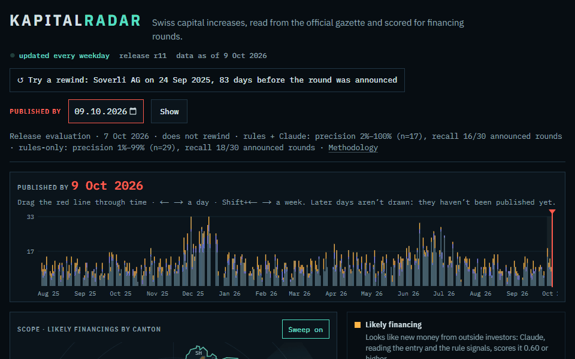

# Kapitalradar

Swiss capital increases, classified with evidence from the official gazette.

Every Swiss AG that raises share capital publishes the change in the Swiss Official Gazette of
Commerce (SHAB). Kapitalradar reads those entries, rebuilds each company's capital history and
scores which increases look like a financing round. It serves the result as a dated record you
can rewind: the round is often in the gazette before the press release (spike: median 10.5
days earlier, 13 of 16 matched rounds).

Live: [kapitalradar.vercel.app](https://kapitalradar.vercel.app). Updated automatically every weekday.



## Evaluation

Release v3 (`r6`, parser v4 with the reserves and conversion rules, data as of 6 Oct 2026),
evaluated 7 Oct 2026. Generated from [`eval/results/release-eval.json`](eval/results/release-eval.json);
earlier releases are archived in [`eval/v1/`](eval/v1/) and [`eval/v2/`](eval/v2/).

| System | Precision (n) | Recall on 30 announced rounds |
|---|---|---|
| Rules + Claude | 10–100 % estimate, 95 % interval 2–100 % (n=17) | 16/30 |
| Rules only | 7–97 % estimate, 95 % interval 1–99 % (n=29) | 18/30 |

Recall ceiling is 20/30: nine announced rounds have no capital increase in the gazette within
the pre-registered window, and one match stays uncertain. Each release is measured on a fresh
sample of companies nobody had inspected. Labels follow one standard: "verified" needs
independent evidence that outside investors funded the step (the register alone can't verify
itself), "refuted" needs positive evidence of an internal explanation. Under that standard
26 of 30 v3 items are unverifiable (3 verified, 1 refuted), so the precision bounds stay wide:
most capital increases are never announced.

How it is measured: [methodology](app/methodology/page.tsx) ·
pre-registration in [`eval/preregistration/`](eval/preregistration/PREREGISTRATION.md) ·
decisions in [`docs/decision-log.md`](docs/decision-log.md).

## How it works

See [ARCHITECTURE.md](ARCHITECTURE.md) and the
[point-in-time release ADR](docs/adr/0001-point-in-time-release.md). In short: the SHAB REST
API feeds an immutable publication store, a parser with privacy-first clause classification
extracts capital steps, rules and `claude-opus-5-5` (run headless on a subscription, name-redacted
input, cached by input hash) score each increase, and a gated release build writes one dated,
immutable release that the app reads as of any date.

## Runbook

**Automated:** `.github/workflows/daily.yml` runs `npm run daily` on weekdays at 09:15 UTC:
ingest the latest gazette days, fetch history for new companies, classify new candidates (Claude
subscription via `CLAUDE_CODE_OAUTH_TOKEN`), crawl new startupticker.ch financing news for
confirmations (cached between runs), build a release that goes live only if every gate
passes (including an eval of the same system), and prune old releases (current + one rollback
target are kept). A failed run emails the repo owner and leaves the live release untouched.
Secrets: `DATABASE_URL`, `CLAUDE_CODE_OAUTH_TOKEN`. A new eval is needed only when the parser,
rules, model, prompt or thresholds change; the gate refuses to publish otherwise.

**Manual (backfill, first setup, or debugging):**

Prerequisites: Node 24 and `.env.local` with `DATABASE_URL` (Neon owner role for the scripts;
the website uses a read-only role).

```bash
npm ci
```

```bash
npm run ingest -- --start 2025-08-01
```

```bash
npm run history -- --run <run-key>
```

```bash
npm run classify -- backfill
```

```bash
npm run build-release -- --release r1 --dry-run
```

```bash
npm run eval -- run --release r1
```

```bash
npm run build-release -- --release r1
```

Rollback re-points to an earlier ready release:

```bash
npm run build-release -- --rollback r0
```

Checks: `npm run typecheck`, `npm test`, `npm run build`, and against a running server
`npm run leak-check -- --base http://localhost:3000`. CI never calls a model or the SHAB.

## Data sources and terms

- **Swiss Official Gazette of Commerce (SOGC/SHAB)**, Official Gazettes Portal, SECO
  ([amtsblattportal.ch](https://www.amtsblattportal.ch)). Its terms of use (§3.1–3.3) allow personal
  and commercial use of the data, with source attribution, no impression of an official
  publication, and compliance with Swiss data protection law.
- **Zefix**, Federal Office of Justice ([zefix.admin.ch](https://www.zefix.admin.ch)): OGD "Open use.
  Must provide the source."
- **startupticker.ch**: the recall cohort lists company names, announcement dates and links only.
  Confirmed rounds are matched automatically against its financing news: the article must link
  the company by its exact legal name, name it in the title, and fall within −120/+180 days of
  exactly one capital increase (otherwise it is a possible confirmation). Only round news counts;
  grants, prizes, loans, listings and acquisitions without new money are excluded. The site shows
  the article date and link; no article text is copied.

This is not an official publication. The authoritative data are those on the Official Gazettes
Portal that bear the SECO electronic signature or stamp.

## Data and privacy

No natural-person data is committed: fixtures are scrubbed and checked against a private name
list (`npm run preregister -- check`). Gazette excerpts are shown in the original language with
person names removed, and every entry links to its SHAB publication. The dataset export
([data card](docs/DATA_CARD.md)) is built but not published.

Not an official publication.
